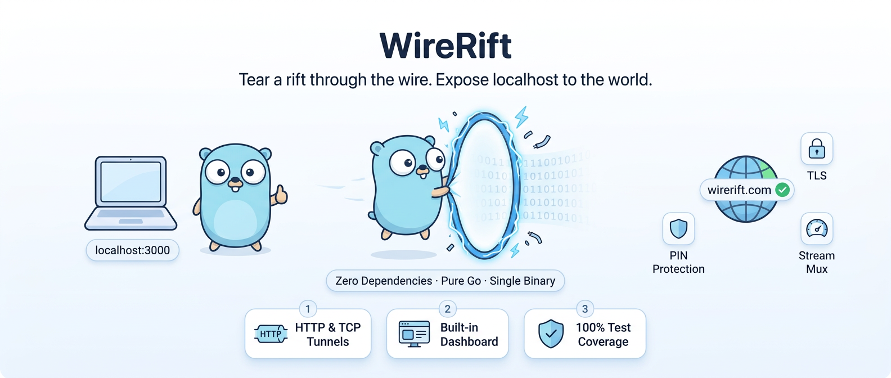

<h1 align="center">WireRift</h1>

<p align="center">
  <strong>Tear a rift through the wire. Expose localhost to the world.</strong>
</p>

<p align="center">
  <a href="https://goreportcard.com/report/github.com/wirerift/wirerift"></a>
  <a href="https://opensource.org/licenses/MIT"></a>
  <a href="https://github.com/WireRift/WireRift/releases/latest"></a>
</p>

<p align="center">
  
</p>

Open-source, zero-dependency tunnel server and client written in Go. Expose any local service to the internet through a secure tunnel — like ngrok, but fully self-hosted.

---

## Table of Contents

- [Features](#features)
- [Installation](#installation)
- [Quick Start](#quick-start)
- [Server Reference](#server-reference)
- [Client Reference](#client-reference)
- [Dashboard](#dashboard)
- [Configuration](#configuration)
- [Access Control](#access-control)
- [Traffic Inspector](#traffic-inspector)
- [Docker](#docker)
- [API Reference](#api-reference)
- [Architecture](#architecture)
- [Benchmarks](#benchmarks)
- [Development](#development)
- [License](#license)

---

## Features

| Category | Features |
|----------|----------|
| **Tunneling** | HTTP tunnels, TCP tunnels, WebSocket passthrough, stream multiplexing, flow control |
| **Security** | Let's Encrypt ACME, self-signed TLS, Basic Auth, IP whitelist (CIDR), PIN protection, HMAC cookies, CSP nonce |
| **Monitoring** | Web dashboard (dark/light theme), traffic inspector, request replay, cURL export, JSON highlighting |
| **Operations** | Health check (`/healthz`), X-Request-ID tracing, graceful shutdown, auto-reconnect, rate limiting |
| **Config** | YAML and JSON config files, CLI flags, environment variables, user-defined tokens |
| **Platform** | Zero dependencies, single binary, Linux/macOS/Windows/FreeBSD, amd64/arm64 |

---

## Installation

### Download Binary (Recommended)

Download the latest release for your platform from [GitHub Releases](https://github.com/WireRift/WireRift/releases/latest).

<details>
<summary><strong>Linux (amd64)</strong></summary>

```bash
curl -Lo wirerift-server https://github.com/WireRift/WireRift/releases/latest/download/wirerift-server-linux-amd64
curl -Lo wirerift https://github.com/WireRift/WireRift/releases/latest/download/wirerift-linux-amd64
chmod +x wirerift-server wirerift
sudo mv wirerift-server wirerift /usr/local/bin/
```
</details>

<details>
<summary><strong>Linux (arm64 / Raspberry Pi)</strong></summary>

```bash
curl -Lo wirerift-server https://github.com/WireRift/WireRift/releases/latest/download/wirerift-server-linux-arm64
curl -Lo wirerift https://github.com/WireRift/WireRift/releases/latest/download/wirerift-linux-arm64
chmod +x wirerift-server wirerift
sudo mv wirerift-server wirerift /usr/local/bin/
```
</details>

<details>
<summary><strong>macOS (Apple Silicon / M1+)</strong></summary>

```bash
curl -Lo wirerift-server https://github.com/WireRift/WireRift/releases/latest/download/wirerift-server-darwin-arm64
curl -Lo wirerift https://github.com/WireRift/WireRift/releases/latest/download/wirerift-darwin-arm64
chmod +x wirerift-server wirerift
sudo mv wirerift-server wirerift /usr/local/bin/
```
</details>

<details>
<summary><strong>macOS (Intel)</strong></summary>

```bash
curl -Lo wirerift-server https://github.com/WireRift/WireRift/releases/latest/download/wirerift-server-darwin-amd64
curl -Lo wirerift https://github.com/WireRift/WireRift/releases/latest/download/wirerift-darwin-amd64
chmod +x wirerift-server wirerift
sudo mv wirerift-server wirerift /usr/local/bin/
```
</details>

<details>
<summary><strong>Windows (amd64)</strong></summary>

Download from [Releases](https://github.com/WireRift/WireRift/releases/latest):
- `wirerift-server-windows-amd64.exe`
- `wirerift-windows-amd64.exe`

Or via PowerShell:
```powershell
Invoke-WebRequest -Uri "https://github.com/WireRift/WireRift/releases/latest/download/wirerift-server-windows-amd64.exe" -OutFile "wirerift-server.exe"
Invoke-WebRequest -Uri "https://github.com/WireRift/WireRift/releases/latest/download/wirerift-windows-amd64.exe" -OutFile "wirerift.exe"
```
</details>

<details>
<summary><strong>Windows (arm64)</strong></summary>

Download from [Releases](https://github.com/WireRift/WireRift/releases/latest):
- `wirerift-server-windows-arm64.exe`
- `wirerift-windows-arm64.exe`
</details>

### Build from Source

Requires Go 1.23+:

```bash
git clone https://github.com/WireRift/WireRift.git
cd WireRift
go build -o wirerift-server ./cmd/wirerift-server
go build -o wirerift ./cmd/wirerift
```

Or with Make:
```bash
make build          # builds both server and client to bin/
make test           # run all tests
make test-race      # run tests with race detector
make fuzz           # run fuzz tests
make bench          # run benchmarks
make docker         # build Docker image
make release        # cross-compile all platforms to dist/
```

---

## Quick Start

### 1. Start the Server

```bash
# With a fixed token (recommended)
wirerift-server --token my-secret-token

# Or let the server generate a random token (shown on startup)
wirerift-server
```

The server prints a connection banner:
```
╔══════════════════════════════════════════════╗
║              WireRift Server                 ║
╠══════════════════════════════════════════════╣
  Control:   :4443
  HTTP:      :80
  Dashboard: http://localhost:4040
  Domain:    wirerift.com
╠══════════════════════════════════════════════╣
  Token (-token flag):
  my-secret-token
╠══════════════════════════════════════════════╣
  Quick start:
  wirerift http 8080 -server localhost:4443 -token my-secret-token
╚══════════════════════════════════════════════╝
```

### 2. Connect a Client

```bash
# Expose local port 8080 via HTTP tunnel
wirerift http 8080 --token my-secret-token

# With custom subdomain
wirerift http 8080 myapp --token my-secret-token

# TCP tunnel (e.g., PostgreSQL)
wirerift tcp 5432 --token my-secret-token

# Serve static files
wirerift serve ./dist --token my-secret-token
```

### 3. Open Dashboard

Visit **http://localhost:4040** and enter your token to see:
- Active tunnels and sessions
- Live traffic inspector
- Request replay and cURL export

---

## Server Reference

```
wirerift-server [options]

Options:
  --token string        Auth token (default: auto-generated random)
  --domain string       Base domain for tunnels (default: wirerift.com)
  --control string      Control plane address (default: :4443)
  --http string         HTTP edge address (default: :80)
  --https string        HTTPS edge address (default: :443)
  --dashboard-port int  Dashboard port (default: 4040)
  --tcp-ports string    TCP tunnel port range (default: 20000-29999)
  --auto-cert           Generate self-signed certificates
  --cert-dir string     Certificate directory (default: certs)
  --acme-email string   Email for Let's Encrypt (enables ACME)
  --acme-staging        Use Let's Encrypt staging server
  --v                   Verbose logging
  --json                JSON log format
  --version             Show version

Environment Variables:
  WIRERIFT_TOKEN         Auth token (flag takes precedence)
  WIRERIFT_DOMAIN        Base domain
  WIRERIFT_CONTROL_ADDR  Control plane address
  WIRERIFT_HTTP_ADDR     HTTP edge address
```

### Examples

```bash
# Development (localhost, self-signed TLS)
wirerift-server --token dev123 --auto-cert

# Production (Let's Encrypt)
wirerift-server --domain mytunnel.com --acme-email admin@mytunnel.com --token prod-secret

# Custom ports
wirerift-server --control :8443 --http :8080 --dashboard-port 9090 --token mytoken

# Via environment
export WIRERIFT_TOKEN=my-secret
export WIRERIFT_DOMAIN=tunnel.example.com
wirerift-server --acme-email admin@example.com
```

---

## Client Reference

```
wirerift <command> [options]

Commands:
  http <port> [subdomain]   Create an HTTP tunnel
  tcp <port>                Create a TCP tunnel
  serve <directory>         Serve static files via HTTP tunnel
  start [config-file]       Start tunnels from config file
  list                      List active tunnels
  config                    Show/edit configuration
  version                   Show version info

Common Options (all commands):
  --server string     Server address (default: localhost:4443)
  --token string      Auth token (or set WIRERIFT_TOKEN env var)
  --v                 Verbose output

HTTP/Serve Options:
  --subdomain string  Requested subdomain
  --auth string       Basic auth "user:password"
  --pin string        PIN protection
  --whitelist string  IP whitelist "ip1,ip2,cidr"
  --header string     Response headers "Key:Val,Key:Val"
  --inspect           Enable traffic inspector
```

> **Note:** Both `--flag` and `-flag` syntax work. Flags can appear before or after positional arguments.

### Examples

```bash
# Simple HTTP tunnel
wirerift http 3000 --token mytoken

# HTTP tunnel with all features
wirerift http 8080 myapp \
  --token mytoken \
  --auth "admin:pass" \
  --pin 1234 \
  --whitelist "10.0.0.0/8,192.168.1.0/24" \
  --header "X-Frame-Options:DENY,X-Robots-Tag:noindex" \
  --inspect

# TCP tunnel (database, game server, SSH, etc.)
wirerift tcp 5432 --token mytoken
wirerift tcp 25565 --token mytoken   # Minecraft
wirerift tcp 22 --token mytoken      # SSH

# Serve a directory
wirerift serve ./build --subdomain mysite --token mytoken

# Start from config file
wirerift start wirerift.yaml
wirerift start wirerift.json
```

---

## Dashboard

The built-in dashboard at `http://localhost:4040` provides:

- **Dark/Light theme** — toggle with button or persisted preference
- **Tabbed navigation** — Tunnels / Sessions / Inspector with live count badges
- **Keyboard shortcuts** — `R` refresh, `T` tunnels, `S` sessions, `I` inspector
- **Tunnel management** — copy URL to clipboard, status indicators
- **Traffic Inspector** — real-time request/response log with:
  - Method badges (GET=green, POST=blue, PUT=amber, DELETE=red)
  - Status code coloring (2xx=green, 4xx=red, 5xx=red)
  - Expandable request/response headers
  - JSON syntax highlighting
  - cURL command export
  - Request replay
- **Animated counters** — bytes and uptime update smoothly
- **Search/filter** — filter across all tables
- **Toast notifications** — action feedback

---

## Configuration

### YAML Format

```yaml
# wirerift.yaml
server: localhost:4443
token: my-secret-token

tunnels:
  - type: http
    local_port: 8080
    subdomain: myapp

  - type: http
    local_port: 9090
    subdomain: admin
    auth: "admin:secret"
    pin: "mysecret"
    whitelist: "10.0.0.0/8"
    inspect: true
    headers: "X-Robots-Tag:noindex"

  - type: tcp
    local_port: 5432
```

### JSON Format

```json
{
  "server": "localhost:4443",
  "token": "my-secret-token",
  "tunnels": [
    {
      "type": "http",
      "local_port": 8080,
      "subdomain": "myapp"
    },
    {
      "type": "http",
      "local_port": 9090,
      "subdomain": "admin",
      "auth": "admin:secret",
      "pin": "mysecret",
      "whitelist": "10.0.0.0/8",
      "inspect": true,
      "headers": "X-Robots-Tag:noindex"
    },
    {
      "type": "tcp",
      "local_port": 5432
    }
  ]
}
```

```bash
wirerift start wirerift.yaml    # YAML
wirerift start wirerift.json    # JSON (auto-fallback if .yaml not found)
wirerift config init            # generate sample wirerift.yaml
```

### Token Configuration

Token is resolved in order: `--token` flag > `WIRERIFT_TOKEN` env > auto-generated.

```bash
# Flag (highest priority)
wirerift-server --token my-secret
wirerift http 8080 --token my-secret

# Environment variable
export WIRERIFT_TOKEN=my-secret
wirerift-server              # reads from env
wirerift http 8080           # reads from env

# Auto-generated (shown on server startup banner)
wirerift-server              # generates random token, prints to stderr
```

---

## Access Control

### Basic Auth

```bash
wirerift http 8080 --auth "user:password"
```

Returns `401 Unauthorized` with `WWW-Authenticate: Basic` header. Uses constant-time comparison.

### IP Whitelist

```bash
wirerift http 8080 --whitelist "203.0.113.50,10.0.0.0/8,192.168.0.0/16"
```

Supports IPv4, IPv6, CIDR notation. HTTP returns `403 Forbidden`, TCP silently drops.

### PIN Protection

```bash
wirerift http 8080 --pin mysecret
```

Three ways to provide PIN:
| Method | Example |
|--------|---------|
| Browser form | Dark-themed PIN page, sets HttpOnly HMAC cookie (24h) |
| HTTP header | `X-WireRift-PIN: mysecret` |
| Query parameter | `https://myapp.tunnel.com/?pin=mysecret` (redirects to clean URL) |

---

## Traffic Inspector

Enable inspection on any tunnel:

```bash
wirerift http 8080 --inspect --token mytoken
```

Dashboard shows live traffic at `http://localhost:4040` (Inspector tab):
- Method, path, status, duration, client IP
- Expandable request/response headers
- JSON body with syntax highlighting
- **Replay** — resend any captured request
- **cURL export** — copy request as curl command

### API Access

```bash
# List captured requests
curl -H "Authorization: Bearer TOKEN" http://localhost:4040/api/requests?limit=50

# Filter by tunnel
curl -H "Authorization: Bearer TOKEN" http://localhost:4040/api/requests?tunnel_id=tun_abc

# Replay a request
curl -X POST -H "Authorization: Bearer TOKEN" http://localhost:4040/api/requests/req_xyz/replay
```

---

## Docker

### Docker Run

```bash
docker build -t wirerift-server .

docker run -d \
  -p 4443:4443 \
  -p 80:80 \
  -p 443:443 \
  -p 4040:4040 \
  -e WIRERIFT_TOKEN=my-secret \
  -v wirerift-certs:/data/certs \
  wirerift-server \
  -domain mytunnel.com -auto-cert
```

### Docker Compose

```bash
docker compose up -d
```

The included `docker-compose.yml` provides:
- Server with control, HTTP, HTTPS, dashboard ports
- TCP tunnel port range (20000-20099)
- Certificate volume persistence
- Health check via `/healthz`
- Non-root container

---

## API Reference

All endpoints require `Authorization: Bearer TOKEN` header.

| Endpoint | Method | Description |
|----------|--------|-------------|
| `/healthz` | GET | Health check (no auth required) |
| `/api/stats` | GET | Server statistics |
| `/api/tunnels` | GET | List active tunnels |
| `/api/sessions` | GET | List connected sessions |
| `/api/requests` | GET | List captured requests |
| `/api/requests/{id}/replay` | POST | Replay a captured request |
| `/api/domains` | GET/POST | List/add custom domains |
| `/api/domains/{domain}` | GET/DELETE | Get/remove domain |
| `/api/domains/{domain}/dns` | GET | DNS records for verification |
| `/api/domains/{domain}/verify` | POST | Verify domain ownership |

### Response Headers

Every proxied request includes:
- `X-Request-ID` — unique trace ID (preserved if sent by client)

---

## Architecture

### Wire Protocol

```
+--------+--------+----------+-----------+
| Version|  Type  | StreamID |  Length   |
| 1 byte | 1 byte | 3 bytes  |  4 bytes  |
+--------+--------+----------+-----------+
|            Payload (variable)          |
+----------------------------------------+

Magic: 0x57 0x52 0x46 0x01 ("WRF\x01")
Header: 9 bytes | Max payload: 16 MB | Max streams: 16M
```

### Connection Flow

```
Client                              Server
  |------- Magic + AUTH_REQ -------->|
  |<------------- AUTH_RES ----------|
  |------- TUNNEL_REQ -------------->|  http://myapp.tunnel.com
  |<------------- TUNNEL_RES -------|
  |                                  |
  |   [ Browser hits myapp.tunnel.com ]
  |                                  |
  |<------ STREAM_OPEN(1) ----------|  New HTTP request
  |<------ STREAM_DATA(1) ----------|
  |------- STREAM_DATA(1) --------->|  Response from local service
  |------- STREAM_CLOSE(1) -------->|
  |                                  |
  |<------ STREAM_OPEN(2) ----------|  Concurrent request!
  |------- HEARTBEAT --------------->|  Keep-alive
  |<------------- HEARTBEAT_ACK ----|
```

### Project Structure

```
wirerift/
├── cmd/
│   ├── wirerift/              # Client CLI
│   └── wirerift-server/       # Server CLI
├── internal/
│   ├── auth/                  # Token authentication
│   ├── client/                # Client implementation
│   ├── config/                # Configuration & domains
│   ├── dashboard/             # Web dashboard & traffic inspector
│   ├── mux/                   # Stream multiplexing & flow control
│   ├── proto/                 # Wire protocol (frame encoding)
│   ├── ratelimit/             # Token bucket & sliding window
│   ├── server/
│   │   ├── server.go          # Core server, session & tunnel management
│   │   ├── http_edge.go       # HTTP request routing & proxying
│   │   ├── pin.go             # PIN protection
│   │   ├── inspect.go         # Traffic inspection & replay
│   │   ├── http_proxy.go      # Request serialization
│   │   ├── tcp_proxy.go       # TCP stream helpers
│   │   └── webhook.go         # Webhook fan-out relay
│   ├── tls/                   # ACME (Let's Encrypt) & certificate management
│   └── utils/                 # Subdomain validation
├── test/
│   ├── advanced/              # Security, stress, reconnect, soak tests (34 tests)
│   ├── benchmark/             # Throughput & latency benchmarks
│   └── integration/           # End-to-end integration tests
├── Dockerfile                 # Multi-stage build (alpine, non-root, healthcheck)
├── docker-compose.yml         # Production-ready compose file
├── Makefile                   # Build, test, lint, fuzz, release targets
└── .golangci.yml              # Linter config (gosec, bodyclose, noctx, etc.)
```

---

## Benchmarks

Tested on AMD Ryzen 9 9950X3D, Windows 11, Go 1.23 (localhost):

| Metric | Value |
|--------|-------|
| Healthz latency | **553 µs** avg |
| HTTP latency overhead | ~0.5 ms (small), ~0 ms (1KB+) |
| Download throughput | **99.6 MB/s** |
| Single-thread RPS | **10,063 req/s** |
| 10 concurrent | 10,335 req/s |
| 50 concurrent | 6,303 req/s |
| 100 concurrent | 4,143 req/s |
| Tunnel creation | **3,163 tunnels/sec** (0.3 ms each) |

```bash
go run ./test/benchmark/       # Throughput & latency
go run ./test/advanced/        # Security, stress, reconnect, soak (34 tests)
go test -bench=. ./internal/   # Micro-benchmarks
```

---

## Development

### Prerequisites

- Go 1.23+
- Git

### Running Tests

```bash
go test ./...                    # All unit tests (15 packages)
go test -race ./...              # With race detector
go test -cover ./...             # With coverage
go run ./test/advanced/          # Advanced E2E suite (34 tests)
go run ./test/benchmark/         # Benchmark suite
```

### Test Coverage

| Package | Coverage |
|---------|----------|
| internal/auth | 100% |
| internal/client | 100% |
| internal/config | 100% |
| internal/mux | 100% |
| internal/proto | 100% |
| internal/ratelimit | 100% |
| internal/utils | 100% |
| internal/server | 99.7% |
| internal/dashboard | 99.3% |
| internal/tls | 97.4% |
| cmd/wirerift | 99.6% |
| cmd/wirerift-server | 97.9% |

### Linting

```bash
go vet ./...
golangci-lint run ./...          # uses .golangci.yml config
```

---

## Security

| Protection | Implementation |
|------------|---------------|
| Authentication | Token-based, constant-time comparison |
| TLS | Let's Encrypt ACME (HTTP-01) or self-signed |
| Basic Auth | Per-tunnel, constant-time comparison |
| IP Whitelist | IPv4/IPv6/CIDR per-tunnel |
| PIN Protection | HMAC cookies (per-instance secret), HttpOnly, Secure, SameSite=Strict |
| Rate Limiting | Per-IP HTTP requests, per-session tunnel creation |
| CSP | Nonce-based Content-Security-Policy on dashboard |
| Headers | X-Frame-Options: DENY, X-Content-Type-Options: nosniff, Referrer-Policy |
| CSRF | Cookie auth restricted to GET requests on dashboard |
| Request Tracing | X-Request-ID auto-generated or preserved |
| Graceful Shutdown | HTTP server drain on SIGTERM/SIGINT |
| Panic Recovery | All production goroutines protected |

---

## Troubleshooting

### Connection refused
Make sure the server is running and the port matches:
```bash
wirerift http 8080 --server localhost:4443 --token YOUR_TOKEN
```

### Invalid token
Token must match between server and client:
```bash
wirerift-server --token abc123          # server
wirerift http 8080 --token abc123       # client — same token
```

### Port already in use
Change the server ports:
```bash
wirerift-server --control :8443 --http :8080 --dashboard-port 9090
```

### Auto-reconnect
Client automatically reconnects with exponential backoff (1s → 30s max) and re-creates all tunnels. No action needed.

---

## License

MIT License — see [LICENSE](LICENSE)
